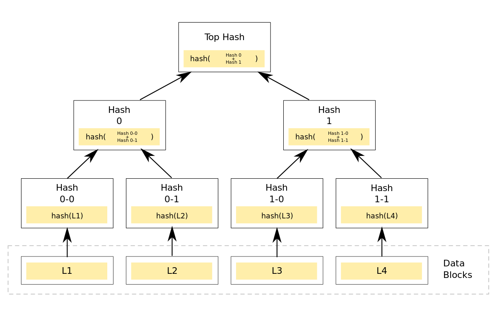

- [Ethereum notes, from the whitepaper](#ethereum-notes-from-the-whitepaper)
  - [Description of the protocol:](#description-of-the-protocol)
    - [Reasons:](#reasons)
    - [Intent](#intent)
    - [Ethereum accounts](#ethereum-accounts)
    - [Transactions](#transactions)
    - [Messages](#messages)
  - [State transition function - APPLY(S, TX) -\> S'](#state-transition-function---applys-tx---s)
    - [Code execution](#code-execution)
    - [Blockchain and mining (TODO)](#blockchain-and-mining-todo)
      - [Merkle trees](#merkle-trees)
      - [Patricia Merkle trees (TODO)](#patricia-merkle-trees-todo)
  - [Applications](#applications)
    - [Token systems](#token-systems)
    - [Financial derivatives and Stable-Value Currencies](#financial-derivatives-and-stable-value-currencies)

# Ethereum notes, from [the whitepaper](https://ethereum.org/en/whitepaper/)

## Description of the protocol:

### Reasons: 
Bitcoin scripting language was limited:
* not Turing-complete (missing loops, among other things)
* value-blind (a script can be set on a UTXO - Unspect Transaction Output; a script can not provide fine-grained control over how much amount to transfer, it's either spent or unspent)
* lack of state (UTXO can only be used to build simple, one-off contracts, not more complex ones)
* blockchain-blind (UTXO are blind to blockchain data like nonce, timestamp and previous block hash)

### Intent 
To be an alternative protocol, for building decentralized applications. A blockchain with a Turing-complete programming language, allowing anyone to write smart contracts and dApps with arbitrary rules for ownership, transaction formats and functions.

### Ethereum accounts 
20-byte addresses, with state transitions being direct transfers of value and information. 

Have:
* nonce (make sure each tx is processed once)
* current ether balance
* contract code (if smart contract)
* storage (if smart contract)

Can be:
* externally-owned accounts controlled by private keys
* contract accounts, controlled by code

**EOA** are the only accounts used to initiate transactions, contract accounts can only react to messages.

### Transactions 
Signed data packages that store messages to be sent from EOAs.

Contain:
* recipient of the message
* signature identifying sender
* amount of ether to transfer from sender to recipient
* optional **data** field
* **STARTGAS** value = max number of computational steps that tx is allowed to take
* **GASPRICE** = fee the sender pays per computational step

First 3 are standard. Ethereum Virtual Machine has an opcode with which a contract can access the optional **data** field.

**Gas** is crucial for anti-denial-of-service. Each tx needs a limit to how many computational steps it can make, and how much it will pay for each. 1 computational step = 1 gas. This is what we call tx fee, and is paid in Ether (ETH).

### Messages
Contracts can send messages to each other (using the **CALL** opcode). This leads to recipient running its' code. Just like tx, but produced by contract and not EOA.

These contain: 
* sender of the message (implicit)
* recipient of the message
* amount of ether to transfer between sender and recipient
* optional data field
* **STARTGAS** field

## State transition function - APPLY(S, TX) -> S'
Can be defined as follows: 
1. Check if tx is well-formed: right number of values, valid signature, nonce matches sender account's nonce.
2. Calculate tx fee = **STARTGAS** * **GASPRICE**; Determine sending address from signature. Substract fee from sender's balance and increment nonce. Return error if not enough balance. 
3. Initialize **GAS** = **STARTGAS**, and substract gas directly proportional to tx length in bytes. 
4. Transfer tx value to recipient. If recipient doesn't exist, create it. If recipient is smart contract, run its' code until completion or out-of-gas.
5. If failed because of value > balance or out-of-gas, revert all state changes except the payment of fees. Add fees to miner's account.
6. Otherwise, refund remaining fees to sender, send fees consumed to miner.

### Code execution
Code is written in a low-level, stack-based bytecode language, called EVM code = series of bytes, each being an operation.

Infinite loop:
* execute code at current program counter
* increment current program counter
* stop if at end, or STOP/RETURN instructions are detected

Three types of space where to store data:
* the stack (LIFO)
* memory, an infinitely expandable byte array
* contract's long-term storage (doesn't reset after computation ends)

Code can also access message's sender, value, data and the block's header. Can return bytecode array as output.

While running, EVM state can be defined by the tuple:
* block_state = global state, containing all accounts with balances and storage
* transaction
* message
* code
* memory
* stack
* pc
* gas

At each round of execution, current instruction is the **pc**th byte of **code**. Each instruction has its own definition of how it affects the tuple. Example:
* **ADD** pups two items off the stack, pushes their sum, decrements gas and increments **pc**.
* **SSTORE** pops two items of the stack and inserts the second item in memory at address=first item.

From whitepaper: "**Although there are many ways to optimize Ethereum virtual machine execution via just-in-time compilation, a basic implementation of Ethereum can be done in a few hundred lines of code.**"

### Blockchain and mining (TODO)
#### Merkle trees
A Merkle for N transactions has N leaves. The parents of those N leaves are N hashes of the information inside. Then, Merkle tree becomes binary. Each two adjacent nodes have a parent, which is the hash of the concatenation of the two nodes. Merkle root is the node at the top.

#### Patricia Merkle trees (TODO)

## Applications
Three types of applications:
* financial applications (sub-currencies, financial derivatives, hedging contracts, savings wallets, wills, employment contracts, etc.)
* semi-financial applications (money involved, but also heavy non-monetary side: self-enforcing bounties for solutions to computational problems)
* applications such as online voting, decentralized governance, which are not financial at all

### Token systems
All currencies or token systems are fundamentally a database with one operation: **subtract X units from A and give them to B, if A has more and X units and transaction was provisioned by A**.

### Financial derivatives and Stable-Value Currencies
